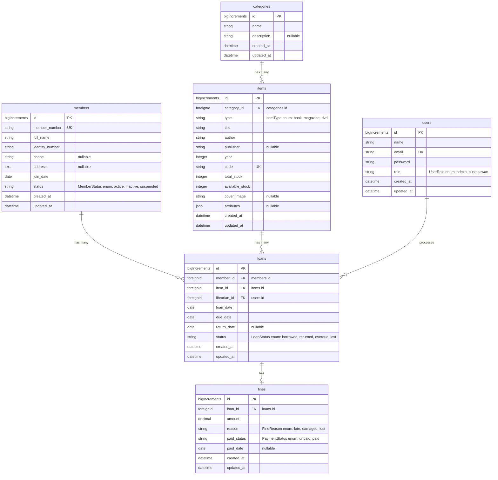

# Sistem Manajemen Perpustakaan (Perpus App)

Aplikasi Sistem Manajemen Perpustakaan berbasis Web SPA modern yang dibangun dengan menggunakan **Laravel 13** di sisi Backend dan **Vue 3 + TypeScript** di sisi Frontend. Autentikasi menggunakan **Laravel Sanctum (Cookie-based SPA)** dan manajemen state server menggunakan **TanStack Vue Query**.

---

## 1. Panduan Instalasi & Menjalankan Aplikasi

> **Penting (Catatan Proxy):** Pengaturan proxy lama di `.yarnrc` telah dihapus agar proses `yarn install` tidak mengalami kegagalan akibat jaringan.

### Langkah-langkah Setup:

1. **Persiapkan Environment & Database:**
   Salin `.env.example` menjadi `.env` dan pastikan konfigurasi DB menggunakan SQLite:
   ```bash
   cp .env.example .env
   ```
   Buat file database kosong:
   ```bash
   touch database/database.sqlite
   ```

2. **Bersihkan Tes Bawaan Starter Kit (Wajib):**
   Hapus folder tes bawaan Fortify/Inertia agar tidak menyebabkan kegagalan saat menjalankan test suite:
   ```bash
   rm -rf tests/Feature/Auth tests/Feature/Settings tests/Feature/DashboardTest.php tests/Feature/ExampleTest.php tests/Unit/ExampleTest.php
   ```

3. **Install Dependensi Composer (Backend):**
   Jalankan perintah berikut untuk mengunduh semua package Laravel:
   ```bash
   composer install
   ```

4. **Jalankan Migrasi & Seeder Database:**
   Perintah ini akan membuat tabel dan mengisi akun demo serta data awal perpustakaan:
   ```bash
   php artisan migrate:fresh --seed
   ```

5. **Hubungkan Storage:**
   Buat symbolic link untuk folder storage agar cover image item dapat diakses publik:
   ```bash
   php artisan storage:link
   ```

6. **Install Dependensi Yarn (Frontend):**
   Jalankan perintah berikut di root folder proyek:
   ```bash
   yarn install
   ```

7. **Jalankan Server Development:**
   Untuk menjalankan backend dan frontend secara bersamaan:
   ```bash
   yarn dev
   ```
   Atau jalankan secara terpisah:
   - Terminal 1: `php artisan serve`
   - Terminal 2: `yarn dev`

8. **Build untuk Produksi (Opsional):**
   ```bash
   yarn build
   ```

---

## 2. Akun Demo Ujian

Gunakan akun berikut untuk masuk ke aplikasi:

| Role | Alamat Email | Kata Sandi | Fitur Akses |
| :--- | :--- | :--- | :--- |
| **Admin** | `admin@perpus.test` | `password` | Seluruh operasi operasional + Hapus data (Destroy) |
| **Pustakawan** | `pustakawan@perpus.test` | `password` | Operasional peminjaman, pengembalian, denda, dan laporan (Tanpa Hapus) |

---

## 3. Matriks Kepatuhan Kriteria Ujian (Compliance Matrix)

Berikut adalah pemenuhan kriteria ujian **(poin a sampai l)** beserta lokasi file implementasinya di dalam kode program:

| Poin | Kriteria Ujian | Deskripsi Pemenuhan | Lokasi Kode / File Utama |
| :--- | :--- | :--- | :--- |
| **a** | Program sesuai rancangan | Skema database dan relasi antar model diimplementasikan secara akurat sesuai spesifikasi rancangan perpustakaan. | [Model Item](file:///Users/wibowo/Kerjaan/RND/perpustakaan-app/app/Models/Item.php), [Model Loan](file:///Users/wibowo/Kerjaan/RND/perpustakaan-app/app/Models/Loan.php) |
| **b** | Coding guidelines dipatuhi | Menggunakan standard PSR-12 di PHP (Laravel Pint) dan Vue 3 Style Guide dengan `<script setup lang="ts">` dan tipe data strict. | Seluruh file di `app/` dan `resources/js/` |
| **c** | Interface Input/Output | Memiliki form validasi visual, modal dialog dinamis, dan tabel interaktif di setiap halaman. | [ItemsPage.vue](file:///Users/wibowo/Kerjaan/RND/perpustakaan-app/resources/js/pages/ItemsPage.vue), [LoansPage.vue](file:///Users/wibowo/Kerjaan/RND/perpustakaan-app/resources/js/pages/LoansPage.vue) |
| **d** | Tipe data & kontrol struktur | Menggunakan Backed Enum PHP, kontrol `if-elseif-else` (denda), `foreach` (import), dan loop `do-while` (nomor anggota unik). | [MemberService.php](file:///Users/wibowo/Kerjaan/RND/perpustakaan-app/app/Services/MemberService.php#L31-L34), [LoanService.php](file:///Users/wibowo/Kerjaan/RND/perpustakaan-app/app/Services/LoanService.php#L112-L139) |
| **e** | Prosedur dan Fungsi | Memisahkan seluruh business logic dari Controller ke dalam Service Class khusus. | Folder [Services](file:///Users/wibowo/Kerjaan/RND/perpustakaan-app/app/Services) |
| **f** | Operasi Array | Menggunakan fungsi `array_map`, `array_filter`, dan `array_reduce` untuk mengolah dan menjumlahkan denda laporan. | [ReportService.php](file:///Users/wibowo/Kerjaan/RND/perpustakaan-app/app/Services/ReportService.php#L91-L104) |
| **g** | Penyimpanan & pembacaan file | Mengunggah & me-resize cover image (Intervention Image), ekspor Excel/CSV (FastExcel), ekspor PDF (DomPDF). | [ItemService.php](file:///Users/wibowo/Kerjaan/RND/perpustakaan-app/app/Services/ItemService.php#L120-L151), [ItemsExport.php](file:///Users/wibowo/Kerjaan/RND/perpustakaan-app/app/Exports/ItemsExport.php) |
| **h** | Penerapan konsep OOP | Inheritance (Item → Book/Magazine/Dvd), Polimorfisme (`displayInfo()`), Interface (`Borrowable`, `Reportable`), Overloading (kalkulator), Value Object (`FineAmount`). | [Dvd.php](file:///Users/wibowo/Kerjaan/RND/perpustakaan-app/app/Models/Dvd.php), [Borrowable.php](file:///Users/wibowo/Kerjaan/RND/perpustakaan-app/app/Interfaces/Borrowable.php), [FineCalculator.php](file:///Users/wibowo/Kerjaan/RND/perpustakaan-app/app/Services/FineCalculator.php#L43-L67) |
| **i** | Penggunaan Namespace | Menggunakan minimal 7 namespace PHP terpisah secara konsisten untuk merapikan kode program. | `App\Enums`, `App\Models`, `App\Services`, `App\Http\Controllers\Api`, dll |
| **j** | Penggunaan Library Eksternal | Memakai package composer (DomPDF, FastExcel, Image-Laravel, Sanctum) dan package yarn (Vue Query, Axios, Zod, Vee-Validate, Sonner). | [composer.json](file:///Users/wibowo/Kerjaan/RND/perpustakaan-app/composer.json), [package.json](file:///Users/wibowo/Kerjaan/RND/perpustakaan-app/package.json) |
| **k** | Penerapan Database | Menggunakan SQLite, migrasi database lengkap dengan relasi foreign keys, dan seeder data awal otomatis. | Folder [database/migrations](file:///Users/wibowo/Kerjaan/RND/perpustakaan-app/database/migrations) dan [database/seeders](file:///Users/wibowo/Kerjaan/RND/perpustakaan-app/database/seeders) |
| **l** | Pembuatan Dokumentasi | PHPDoc di seluruh class/method PHP, TSDoc di script TypeScript frontend, dan README.md ini. | Seluruh file di `app/` dan `resources/js/` |

---

## 4. Cara Menjalankan Test Suite

Untuk memastikan seluruh logika bisnis, pemangkasan stok, kalkulasi denda otomatis, dan restriksi role berjalan dengan benar:

```bash
php artisan test
```

Test suite mencakup:
- **Unit Test:** `ItemPolymorphismTest`, `FineCalculatorTest`, `InterfaceContractsTest`, `ValueObjectAndEnumTest`, dan `ExceptionsTest`.
- **Feature Test:** `LibraryAuthTest`, `CategoryApiTest`, `ItemApiTest`, `LoanApiTest`, `FineApiTest`, dan `ErrorHandlingTest`.

---

## 5. Entity Relationship Diagram (ERD)

Berikut adalah diagram hubungan entitas (ERD) untuk Sistem Manajemen Perpustakaan (Perpus App) yang digambarkan menggunakan Mermaid.js:



### Penjelasan Relasi Entitas (Kardinalitas)

1. **`categories` ke `items` (1:M / One-to-Many)**:
   * Setiap **Kategori** (`categories`) dapat memiliki satu atau banyak **Item Pustaka** (`items`).
   * Sebaliknya, satu **Item Pustaka** hanya boleh terikat pada tepat satu **Kategori** via `category_id`.
   
2. **`members` ke `loans` (1:M / One-to-Many)**:
   * Setiap **Anggota** (`members`) dapat melakukan banyak kali transaksi **Peminjaman** (`loans`) secara historis.
   * Sebaliknya, satu baris data **Peminjaman** hanya mencatat satu **Anggota** yang bertanggung jawab via `member_id`.

3. **`items` ke `loans` (1:M / One-to-Many)**:
   * Setiap **Item Pustaka** (`items`) dapat dipinjam berkali-kali dalam transaksi **Peminjaman** (`loans`) yang berbeda (misalnya setelah dikembalikan, item tersebut dipinjam kembali).
   * Sebaliknya, satu transaksi **Peminjaman** hanya boleh meminjam satu **Item Pustaka** via `item_id`.

4. **`users` ke `loans` (1:M / One-to-Many)**:
   * Setiap **User/Pustakawan/Admin** (`users`) dapat memproses banyak transaksi **Peminjaman** (`loans`).
   * Sebaliknya, setiap transaksi **Peminjaman** mencatat satu **Pustakawan** yang melayani transaksi tersebut via `librarian_id`.

5. **`loans` ke `fines` (1:1 / One-to-One / Zero-or-One)**:
   * Setiap transaksi **Peminjaman** (`loans`) dapat memiliki maksimal satu catatan **Denda** (`fines`) apabila terjadi keterlambatan pengembalian atau kerusakan item (bersifat opsional, *zero or one*).
   * Sebaliknya, satu catatan **Denda** merujuk ke tepat satu transaksi **Peminjaman** via `loan_id`.


